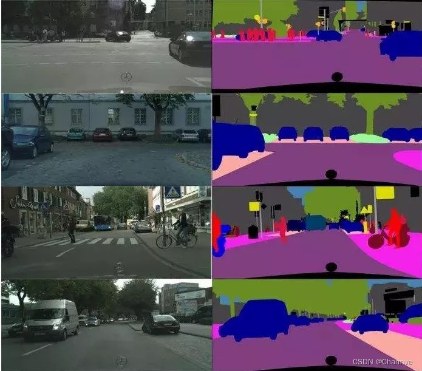
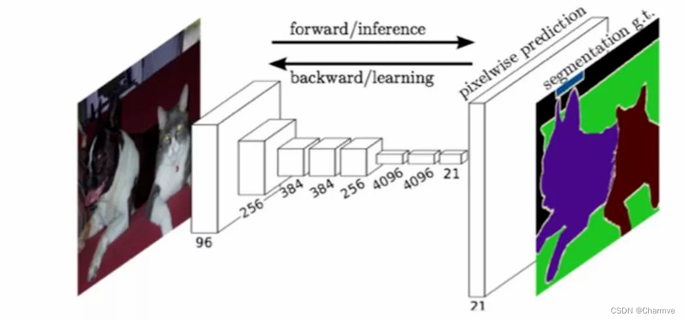
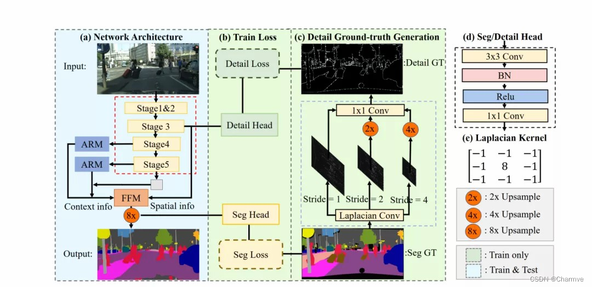
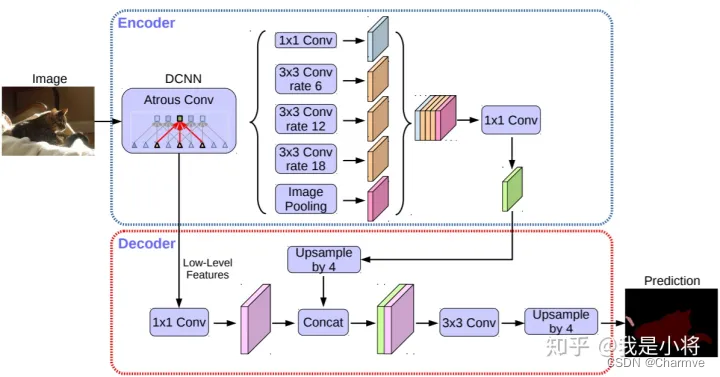
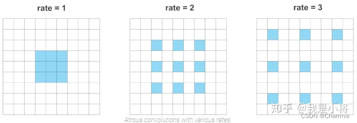
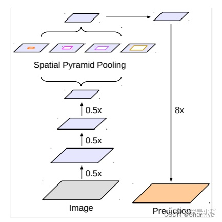
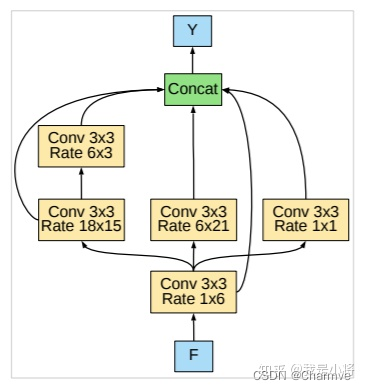
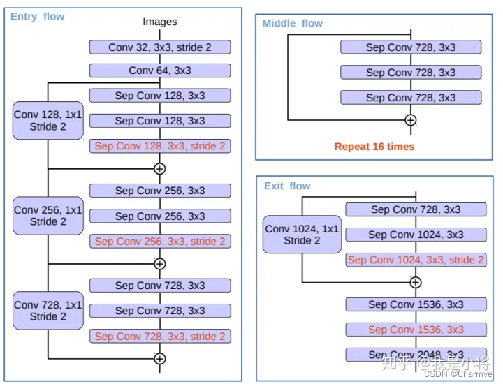

# 语义分割网络详解（DeepLabV3、FCN、UNet等）

 

# 1 什么是语义分割技术?
近年来，随着深度学习技术的快速发展，计算机视觉领域中的许多使用传统方法难以解决的任务都取得了巨大的突破。特别是在图像语义分割领域，深度学习技术的作用表现尤为突出。图像语义分割作为计算机视觉中一项基础且具有挑战性的任务，其目标是将对应的语义标签分配给图像中的每个像素，其结果是将给定图像划分为若干视觉上有意义或感兴趣的区域，以利于后续的图像分析和视觉理解。

下图是在 Cityscapes 数据集上的图像原图和其对应的 ground truth。可以看到，图像分割任务要求对原图的每一个像素进行逐像素预测其类别。由于需要逐像素预测该物体所属类别，这对深度学习模型提出了巨大的挑战，比如部分目标尺寸较小、难以识别，部分目标大部分被遮挡，导致其辨识度降低等。

尽管存在着上述各种各样的困难，语义分割技术仍因其巨大的不可替代的价值，成为自动驾驶技术栈中不可或缺的一部分。自动驾驶技术中的许多地方都需要使用到语义分割技术。比如车道线识别中，毫末智行的感知算法工程师们就使用了语义分割技术来识别车道线的位置和轮廓。如下图所示，使用语义分割得到的车道线，相较于其他方法，有更加清晰的边缘，准确率和召回率也高很多。

车道线语义分割的结果展示

（左边是分割后的结果，右边是原图 。红色的区域就是分割算法分割出来的车道线的位置）

图像分割可以分为两类：语义分割（Semantic Segmentation）和实例分割（Instance Segmentation），其区别如图2所示。

图2 图像分割中的语义分割和实例分割

可以看到语义分割只是简单地对图像中各个像素点分类，但是实例分割更进一步，需要区分开不同物体，这更加困难，从一定意义上来说，实例分割更像是语义分割加检测。这里我们主要关注语义分割。

# 2 常见的语义分割网络
从 FCN 算法、UNet 算法，到适用于自动驾驶任务的 STDC 算法，接下来为大家详细的介绍分割技术中最热门的的三类“流量”担当。

## 2.1 FCN 算法

(Fully Convolutional Networks for Semantic Segmentation)

2012年，AlexNet 以超越第二名(特征点匹配法+SVM)10个点的精度宣告深度学习时代的来临。随后人们开始尝试使用类似 AlexNet 的方法进行图像语义分割，但是由于 AlexNet 是对图像整体进行分类的，无法做到像素级的分类。而究竟怎么做到对图像中的每一个像素都进行分类预测，在那个时候仍然是一个世界难题。在当时，无数的科研人员尝试将图片分为若干个 Patch 后送入网络中学习，希望网络能够对 Patch 进行分类，但最终效果都不理想。直到2015年，Jonathan Long 发表了《Fully Convolutional Networks for Semantic Segmentation》。至此，图像语义分割的天空迎来了第一缕阳光。

FCN 算法的主要流程如下图所示，主要原理是让图片经过不同的卷积层和池化层，从而提取到图片的特征。每一层卷积就像一个放大镜一样去遍历图片的每一个像素，每遍历一个位置，放大镜就会输出对应位置的物体类别。举个简单的例子，用一个3x3的卷积核和图片做卷积，就可以简单的理解为用一个放大镜去遍历图片的每一个位置，放大镜每次看一个位置后，就输出对应位置的类别。

FCN 算法是图像分割技术中里程碑式的一站，但是正如其他行业的里程碑一样，FCN 只是起点。其仍然有一定的缺点。具体包括以下两点：

- FCN 算法的结果仍然不够精细;
- FCN 只是逐像素预测，而没有考虑像素间的关系。

## 2.2 UNet 算法

(UNet++: A Nested U-Net Architecture for Medical Image Segmentation)

2015 年，在 FCN 的基础之上，Olaf Ronneberge 等人提出了一种被称为 U-Net 的 U 型网络架构，该算法在医学图像分割、遥感分割等分割任务中获得了广泛应用。该网络的特征在于，编码器由一系列的卷积和最大汇合层构成，解码端由镜像对称的卷积层和转置卷积序列组成。由于分割网络结构中不同的卷积层对特征的抽象层次不同，为了产生高质量的分割结果，因此 U-Net 结构使用跳层连接将编码端的特征图镜像堆叠到解码端对应层级，如图所示。

U-Net 的结构特点为：编码器能够提取深层的图像语义信息，解码器通过跳层连接机制来连接位置信息丰富的浅层特征图和语义特征信息丰富的深层特征图，然后进行逐层上采样。这种逐层上采样和特征融合的方式有利于将深层的语义信息往浅层传递，同时跳层连接促进了网络收敛。

U-Net 算法是语义分割技术中的第二个里程碑式的算法。后续的许多算法都是基于 U-Net 算法进行改进。其优点是精度很高，但是其速度较慢，难以满足自动驾驶的要求。

## 2.3 适用于自动驾驶任务的 STDC 算法

(Rethinking BiSeNet For Real-time Semantic Segmentation)

U-Net 算法虽然具有精度高的特点，但是其速度并不能满足自动驾驶的要求。为了解决速度不够的问题，STDC 算法应运而生。

STDC 算法的基本原理如下图所示。

STDC 算法采用了类似 FCN 算法的结构，其去掉了 U-Net 算法复杂的 decoder 结构。但同时在网络下采样的过程中，利用 ARM 模块不断的去融合来自不同层的特征图的信息，因此也避免了 FCN 算法只考虑单个像素关系的缺点。可以说，STDC 算法很好的做到了速度与精度的平衡，其可以满足自动驾驶系统实时性的要求。

## 2.4 DeepLabv3+详解

与检测模型类似，语义分割模型也是建立是分类模型基础上的，即利用CNN网络来提取特征进行分类。对于CNN分类模型，一般情况下会存在stride>1的卷积层和池化层来降采样，此时特征图维度降低，但是特征更高级，语义更丰富。这对于简单的分类没有问题，因为最终只预测一个全局概率，对于分割模型就无法接受，因为我们需要给出图像不同位置的分类概率，特征图过小时会损失很多信息。其实对于检测模型同样存在这个问题，但是由于检测比分割更粗糙，所以分割对于这个问题更严重。但是下采样层又是不可缺少的，首先stride>1的下采样层对于提升感受野非常重要，这样高层特征语义更丰富，而且对于分割来说较大的感受野也至关重要；另外的一个现实问题，没有下采样层，特征图一直保持原始大小，计算量是非常大的。相比之下，对于前面的特征图，其保持了较多的空间位置信息，但是语义会差一些，但是这些空间信息对于精确分割也是至关重要的。这是语义分割所面临的一个困境或者矛盾，也是大部分研究要一直解决的。

对于这个问题，主要存在两种不同的解决方案，如图3所示。其中a是原始的FCN（Fully Convolutional Networks for Semantic Segmentation），图片送进网络后会得到大小降为32x的特征图，虽然语义丰富但是空间信息损失严重导致分割不准确，这称为FCN-32s，另外paper还设计了FCN-8s，大致是结合不同level的特征逐步得到相对精细的特征，效果会好很多。为了得到高分辨率的特征，一种更直观的解决方案是b中的EncoderDecoder结构，其中Encoder就是下采样模块，负责特征提取，而Decoder是上采样模块（通过插值，转置卷积等方式），负责恢复特征图大小，一般两个模块是对称的，经典的网络如U-Net（U-Net: Convolutional Networks for Biomedical Image Segmentation。而要直接将高层特征图恢复到原始大小是相对困难的，所以Decoder是一个渐进的过程，而且要引入横向连接（lateral connection），即引入低级特征增加空间信息特征分割准确度，横向连接可以通过concat或者sum操作来实现。另外一种结构是c中的DilatedFCN，主要是通过空洞卷积（Atrous Convolution）来减少下采样率但是又可以保证感受野，如图中的下采样率只有8x，那么最终的特征图语义不仅语义丰富而且相对精细，可以直接通过插值恢复原始分辨率。天下没有免费的午餐，保持分辨率意味着较大的运算量，这是该架构的弊端。这里介绍的DeepLabv3+就是属于典型的DilatedFCN，它是Google提出的DeepLab系列的第4弹。

图3 语义分割不同架构（来源：https://arxiv.org/abs/1903.11816）

### 整体架构
DeepLabv3+模型的整体架构如图4所示，它的Encoder的主体是带有空洞卷积的DCNN，可以采用常用的分类网络如ResNet，然后是带有空洞卷积的空间金字塔池化模块（Atrous Spatial Pyramid Pooling, ASPP)），主要是为了引入多尺度信息；相比DeepLabv3，v3+引入了Decoder模块，其将底层特征与高层特征进一步融合，提升分割边界准确度。从某种意义上看，DeepLabv3+在DilatedFCN基础上引入了EcoderDecoder的思路。

图4 DeepLabv3+模型的整体架构

对于DilatedFCN，主要是修改分类网络的后面block，用空洞卷积来替换stride=2的下采样层，如下图所示：其中a是原始FCN，由于下采样的存在，特征图不断降低；而b为DilatedFCN，在第block3后引入空洞卷积，在维持特征图大小的同时保证了感受野和原始网络一致。

图5 DilatedFCN与传统FCN对比

在DeepLab中，将输入图片与输出特征图的尺度之比记为output_stride，如上图的output_stride为16，如果加上ASPP结构，就变成如下图6所示。其实这就是DeepLabv3结构，v3+只不过是增加了Decoder模块。这里的DCNN可以是任意的分类网络，一般又称为backbone，如采用ResNet网络。

图6 output_stride=16的DeepLabv3结构

### 空洞卷积

空洞卷积（Atrous Convolution）是DeepLab模型的关键之一，它可以在不改变特征图大小的同时控制感受野，这有利于提取多尺度信息。空洞卷积如下图所示，其中rate（r）控制着感受野的大小，r越大感受野越大。通常的CNN分类网络的output_stride=32，若希望DilatedFCN的output_stride=16，只需要将最后一个下采样层的stride设置为1，并且后面所有卷积层的r设置为2，这样保证感受野没有发生变化。对于output_stride=8，需要将最后的两个下采样层的stride改为1，并且后面对应的卷积层的rate分别设为2和4。另外一点，DeepLabv3中提到了采用multi-grid方法，针对ResNet网络，最后的3个级联block采用不同rate，若output_stride=16且multi_grid = (1, 2, 4), 那么最后的3个block的rate= 2 · (1, 2, 4) = (2, 4, 8)。这比直接采用(1, 1, 1)要更有效一些，不过结果相差不是太大。

图7 不同rate的空洞卷积

### 空间金字塔池化（ASPP）
在DeepLab中，采用空间金字塔池化模块来进一步提取多尺度信息，这里是采用不同rate的空洞卷积来实现这一点。ASPP模块主要包含以下几个部分： （1） 一个1×1卷积层，以及三个3x3的空洞卷积，对于output_stride=16，其rate为(6, 12, 18) ，若output_stride=8，rate加倍（这些卷积层的输出channel数均为256，并且含有BN层）； （2）一个全局平均池化层得到image-level特征，然后送入1x1卷积层（输出256个channel），并双线性插值到原始大小； （3）将（1）和（2）得到的4个不同尺度的特征在channel维度concat在一起，然后送入1x1的卷积进行融合并得到256-channel的新特征。

图8 DeepLab中的ASPP

ASPP主要是为了抓取多尺度信息，这对于分割准确度至关重要，一个与ASPP结构比较像的是[PSPNet]（Pyramid Scene Parsing Network）中的金字塔池化模块，如下图所示，主要区别在于这里采用池化层来获取多尺度特征。

图9 PSPNet中的金字塔池化层

此外作者在近期的文章（Searching for Efficient Multi-Scale Architectures for Dense Image Prediction）还尝试了采用NAS来搜索比ASPP更有效的模块，文中称为DPC（Dense Prediction Cell），其搜索空间包括了1x1卷积，不同rate的3x3空洞卷积，以及不同size的平均池化层，下图是NAS得到的最优DPC，这是人工所难以设计的。

图10 最优DPC

### Decoder
对于DeepLabv3，经过ASPP模块得到的特征图的output_stride为8或者16，其经过1x1的分类层后直接双线性插值到原始图片大小，这是一种非常暴力的decoder方法，特别是output_stride=16。然而这并不利于得到较精细的分割结果，故v3+模型中借鉴了EncoderDecoder结构，引入了新的Decoder模块，如下图所示。首先将encoder得到的特征双线性插值得到4x的特征，然后与encoder中对应大小的低级特征concat，如ResNet中的Conv2层，由于encoder得到的特征数只有256，而低级特征维度可能会很高，为了防止encoder得到的高级特征被弱化，先采用1x1卷积对低级特征进行降维（paper中输出维度为48）。两个特征concat后，再采用3x3卷积进一步融合特征，最后再双线性插值得到与原始图片相同大小的分割预测。

图11 DeepLab中的Decoder

### 改进的Xception模型
DeepLabv3所采用的backbone是ResNet网络，在v3+模型作者尝试了改进的Xception，Xception网络主要采用depthwise separable convolution，这使得Xception计算量更小。改进的Xception主要体现在以下几点： （1）参考MSRA的修改（Deformable Convolutional Networks），增加了更多的层； （2）所有的最大池化层使用stride=2的depthwise separable convolutions替换，这样可以改成空洞卷积 ； （3）与MobileNet类似，在3x3 depthwise convolution后增加BN和ReLU。

采用改进的Xception网络作为backbone，DeepLab网络分割效果上有一定的提升。作者还尝试了在ASPP中加入depthwise separable convolution，发现在基本不影响模型效果的前提下减少计算量。

图12 修改的Xception网络

结合上面的点，DeepLabv3+在VOC数据集上的取得很好的分割效果：

关于DeepLab模型的实现，Google已经开源在tensorflow/models，采用Google自家的slim来实现的。一点题外话是，作者最近有研究了NAS在分割网络的探索，叫做Auto-DeepLab（Auto-DeepLab:Hierarchical Neural Architecture Search for Semantic Image Segmentation），不同于前面的工作，这个真正是网络级别的NAS，其搜索空间更大。

### 小结

DeepLab作为DilatedFCN的典范还是值得学习的，其分割效果也是极其好的。但是由于存在空洞卷积，DeepLab的计算复杂度要高一些，特别是output_stride=8，对于一些要求低延迟的场景如无人车，还是需要更加轻量级的分割模型，这也是近来的研究热点。

========================================================

更接地气?
# 3. 语义分割的未来
虽然语义分割技术已经取得了许多的进展，但其距离实用仍然或多或少存在一定的差距。我们认为，语义分割技术在未来的发展趋势主要包括以下几点：

更加清晰的边缘分割结果。目前各大主流语义分割技术对边缘的分割都存在分割不够清晰的问题，这对实际应用会造成很大影响。
与频率域相结合。一个更加鲁棒的表示会极大提高模型的表现，多项研究发现，把图像从空间域转换到频率域的表达会提高分割模型的表现同时降低模型的复杂度。
使用 Transformer。Transformer 技术最近在计算机视觉的各项任务中一枝独秀，在分割领域中更是如此。这主要得益于 transformer 的 self-attention 模块可以兼顾全局感受野和局部感受野的信息，这对于分割任务而言是及其重要的。可以预见，Transformer 模型将带领语义分割领域迈上新的台阶。 

# 参考
Rethinking Atrous Convolution for Semantic Image Segmentation
Encoder-Decoder with Atrous Separable Convolution for Semantic Image Segmentation

