# 纯视觉感知和传感器融合方案对比，特斯拉九头蛇的进化

@[TOC](目录)

纯视觉or多传感器融合？自动驾驶在感知技术方面的路线之争始终热烈，两方阵营各有知名企业坐镇。

一边是特斯拉放弃毫米波雷达，选择纯视觉感知路线，另一边是中国厂商却加紧激光雷达的布局，走多传感器融合路线。

“任何依靠激光雷达（开发自动驾驶）的企业注定完蛋。这些昂贵的传感器毫无必要，就像是长了个昂贵的阑尾。”早在2019年的Autonomy Day大会上，特斯拉CEO马斯克就公开质疑过激光雷达的实用性。

但一批国内厂商却持有不同的声音，目前，无论蔚来、小鹏、理想、威马、智己等新势力，还是长城、一汽等传统主机厂，纷纷在新车型上搭载激光雷达，形成摄像头、毫米波雷达、激光雷达等多传感器融合的系统，和特斯拉走上一条完全不同的道路。

“汽车真的需要激光雷达吗？如果我们只靠人眼开车，每10万人中就有18人死于交通事故，当时速到达70公里以上时，死亡率攀升到98%，这是不能被接受的，因此我们要想办法超越人的极限，激光雷达，本质是对人眼的视觉运力提升和控制力提升。”激光雷达生产厂商北醒科技CEO李远在第20届中国汽车供应链大会上如是说。

自动驾驶的感知系统路线之争，逐渐由纯粹的学术理论问题演变为现实的供应链格局问题。

## 不同的多传感器融合路线

单一传感器的感知方案存在着不可避免的缺陷，会在某些场景中失效造成恶劣后果，即便增加单一传感器的数量也不能从根本上解决问题

多传感器融合主要有三个优势：
- 第一是提升系统感知准确度，多种传感器联合互补，可避免单一传感器的局限性，最大程度发挥各种传感器的优势。
- 第二则是提升系统感知可靠性，多传感器融合可带来一定的信息冗余度，即使某一传感器出现故障，系统仍可正常工作；
- 第三是增强环境适应能力，多传感器融合技术采集的信息具有明显的特征互补性，弥补了单一传感器的语义不确定性。

在视觉技术还不够成熟的时候，激光雷达是可以被用来『补短板』，多一个信息维度的输入保证安全。

缺点：
- 信息冗余；
- 成本较高；

## 「仍要以视觉传感器为主」

多传感器融合是必然的自动驾驶技术方案，它能够真正的保证自动驾驶的安全性，而践行该方案时却应当以视觉传感器为主。

首先，相机传感器能够提供丰富的语义信息，这是激光雷达或者毫米波雷达所不能做到的；其次，相机的可拓展性更强，容易被适配到各种车型上；最后，从时间线上来说，相机比其他传感器多几个数量级的训练数据，且具有价格上的优势。

## 纯视觉 V.S. 多传感器融合比较

- **降本与量产难题。** 纯视觉方案的最主要优势是成本低，而多传感器融合方案可以更好地处理corner case，但对算力要求非常高，也有非常高的硬件成本。
- **算法迭代难题。** 纯视觉系统辨别物体高度依赖样本的训练，难以辨别样本未覆盖的物体，这也导致其在初期应对corner case的能力有限。目前大部分车企倾向于选择带激光雷达的方案，其原因在于纯视觉方案走到量产落地需要花更长的时间，而现在竞争主要是加速商业化落地，速度至关重要。
- **传感器冗余和融合难题。** 多传感器融合确实是比较复杂、容易出问题的地方，摄像头和雷达独立去做采集和感知，决策过程中还要做取舍和判断，如果规则设定或者系统架构不合理，也有可能会出现1+1＜1的情况。

不管是纯视觉、激光雷达，还是别的技术路线，最终在市场上胜出的自动驾驶解决方案，看的还是用户体验。如果纯视觉方案和带激光雷达方案的安全性与用户体验相当，那么市场自然会偏向纯视觉的方向，毕竟这其中直接涉及到整车的成本，但这也是一个循序渐进的过程。

## 特斯拉：从毫米波雷达到纯视觉感知

### 1. 九头蛇的进化：Tesla AutoPilot 纯视觉方案解析

话不多说，要看懂这个方案我们首先明确一下：Tesla视觉系统的输入和输出↓

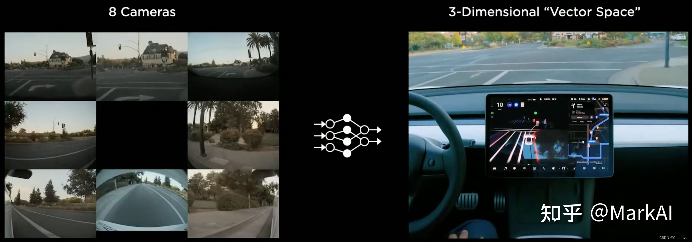

图一，Tesla视觉感知系统的输入和输出

Tesla的视觉系统由8个摄像头环绕车身，视野范围达 360 度，每个摄像头采集分辨率为1280 × 960，12-Bit, 36Hz的RAW格式图像，对周围环境的监测距离最远可达 250 米。

摄像头捕获环境中的视觉信息经过一系列神经网络模型的处理，最终直接输出3D场景下的 ”Vector Space”用于后面的规划和智驾系统。

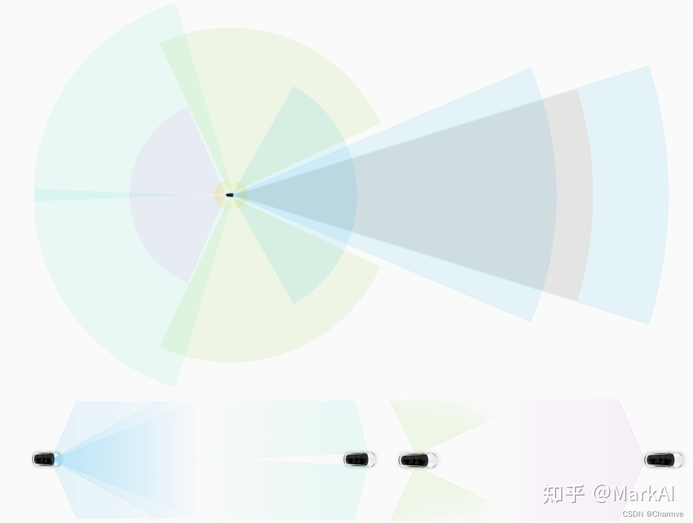

图二，Tesla车载相机布置方式

Tesla的8摄像头分为前视3目，负责近，中远3种不同距离和视角的感知；侧后方两目，侧前方两目，以及后方单目，完整覆盖360度场景。

Tesla的自动驾驶感知算法经过了多个版本迭代，最初的HydraNet是比较早期的版本，经过不断的迭代一路进化，应用到了近期的FSD系统中。我们首先介绍一下最初的HydraNet。

### 1.1 HydraNet
HydraNet以分辨率为1280×960，12-Bit, 36Hz的RAW格式图像作为输入，采用的Backbone为RegNet，并使用BiFPN构建多尺度feature map，再在上面再添加task specific的Heads。

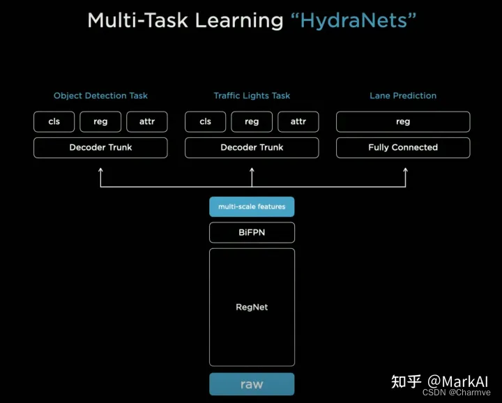

图三，HydraNet模型结构

熟悉目标检测或是车道线检测的同学可以发现，初代HydraNet的各个组成部分都是常规操作，没有太多特殊的地方，共享Backbone和BiFPN能够在部署的时候很大程度的节省算力，也算是业界比较常见的。

但是，Tesla却把这样的结构玩出了花来，用这样的结构带来以下三点好处：

1、预测的时候非常高效：因为共享特征，避免了大量的重复计算；

2、可以解耦每个子任务：每个子任务可以在backbone的基础上进行fine-tuning，或是修改，而不影响其他子任务。

3、可以加速fine-tuning：训练过程中可以将feature缓存，这样fine-tuning的时候可以只使用缓存的feature来fine-tune模型的head，而不再需要重复计算。

所以HydraNet实际的训练流程是先端到端地训练整个模型，然后使用缓存的feature分别训练每个子任务，然后再端到端地训练整个模型，以此迭代。

牛就一个字啊！就这样，一个普通的模型就被Tesla把潜力挖掘到了极致，模型训练中一切不必要的计算开销都被省略了。

惊叹Tesla工程能力和精打细算的同时我们可以发现，这样的简单模型如果是使用单相机图像作为输入，有很大盲区，只能用于车道保持等很简单的辅助驾驶任务，并且需要借助其他传感器(如超声波雷达)的辅助来降低风险。

更复杂的自动驾驶任务需要使用多个相机的图像作为感知系统的输入，同时感知系统的预测结果需要转换到三维空间中的车体坐标系下，才能输入到规控系统用以规划驾驶行为。

多相机输入相对单相机不是简单的在多个相机上分别预测，然后投影到车体坐标系下就可以了，而是需要协调好多个相机的感知结果，是一个很复杂的工程问题。

针对这一问题，Tesla给出了一个很好的解决方案。

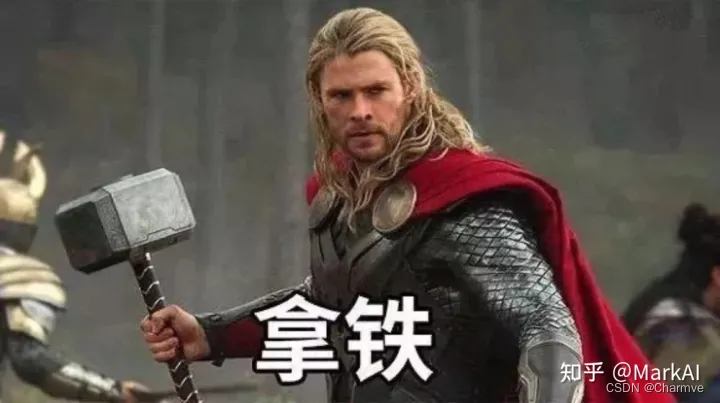

#### 1.11 进化一：多相机输入

我们知道不能简单使用图像上的感知结果来进行自动驾驶，要精确的知道每个交通参与者的位置，道路的走向，需要车体坐标下(Tesla在这里命名为Vector Space)的感知结果。要得到这样的感知结果有三种可能的方案：

**方案1：**在各个摄像头上分别做感知任务，然后投影到车体坐标系下进行整合；

**方案2：**将多个摄像头的图像直接变换和拼接到车体坐标系下，再在拼接后的图像上做感知任务；

**方案3：**直接端到端处理，输入多相机图像，输出车体坐标下的感知结果；

对于方案1，实践发现图像空间的输出并不是正确的输出空间，比如图四，图像空间显示很好的车道线检测结果，投影到Vector space之后，就变得不太能用。

问题的原因在于需要精确到像素级别的预测， 才能够比较准确地将结果投影到Vector space，而这一要求过于严格。

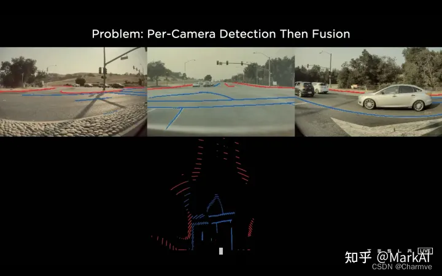

图四，图像空间下很好的车道线结果在Vector Space下不太理想

同时，在多相机的目标检测中，当一个目标同时出现在两个以上摄像头的视野中时，投影到车体坐标之后会出现重影；此外，对于一些比较大的目标，一个摄像头的视野不足以囊括整个目标，每个摄像头都只能捕捉到局部，整合这些摄像头的感知结果就会变成非常困难的事情。

对于方案2，图像完美拼接本就是一件非常困难的事情，同时拼接还会受到路平面以及遮挡的影响。

于是Tesla最终选用了方案3。方案3会面临如下两方面的问题，一方面是如何将图像空间的特征转换到vector space，另一个问题是如何获得vector space下的标注数据。

MarkAI：自动驾驶の核燃料库！Tesla数据标注系统解析
208 赞同 · 46 评论文章

这里主要探讨第一个问题。

关于将图像空间的特征转换到vector space，Tesla采用的方案是直接使用一个Multi-Head Attention的transformer来表示这个转换空间，而将每个摄像头的图像转换为key和value。

我看到这一操作后简直惊为天人，这个方案精妙，完美地运用了Transformer的特点，将每个相机对应的图像特征转换为Key和value，然后训练模型以查表的方式自行检索需要的特征用于预测。

同时难以置信的是，业界还在讨论Transformer能不能用到产品端的时候，Tesla已经悄无声息地将其插入到了最新的系统中！

因为这样的设计，不需要显式地在特征空间上做一些几何变换操作，也不受路平面等因素的干扰，很优雅地将输入信息过渡到了Vector Space!

图五，使用Transformer整合多相机信息

不用怀疑，加入这一优化后的结果就是车道线更加准确清晰，目标检测的结果更加稳定，同时不再有重影。

图六，使用Transformer整合多目信息后，感知效果明显提升

#### 1.1.2 进化二：时间和空间信息

经过上一步的进化，感知模型虽然可以在多相机输入的情况下得到Vector Sapce下稳定和准确的预测结果，但是依然是单帧处理的，没有考虑时序信息。

而在自动驾驶场景，需要对交通参与者的行为有预判，同时视觉上的遮挡等情况需要结合多帧信息进行处理，因此需要将时序信息考虑进来。

为此，Tesla在网络中又添加了特征队列模块(Feature queue module)用来缓存时序上的一些特征，以及视频模块(Video module)用来融合时序上的信息。此外，还给模型加入了IMU等模块带来的运行学信息比如车速和加速度。

经上述模块处理之后的特征融合了时序上的多相机特征，在Heads中进行解码得到最终输出。

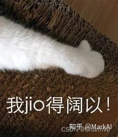

下面首先介绍特征队列模块。

特征队列模块将时序上多个相机的特征，运动学的特征，以及特征的position encoding concat到一起，这一组合后的特征将在Video Module中使用。

顾名思义，特征队列模块按照队列的数据结构组织特征序列，根据队列的入队规则可分为时间特征队列(Time based queue)以及空间特征队列(Spatial based queue)。
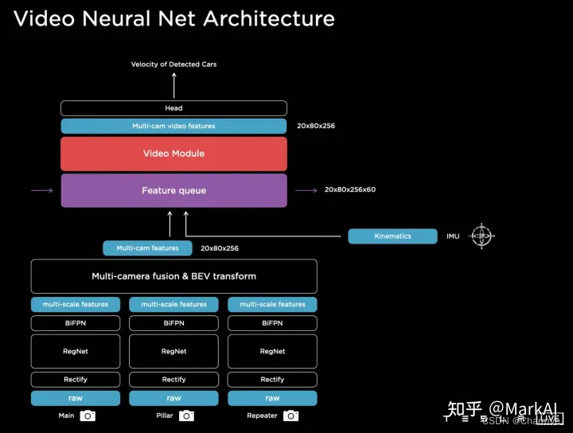
图七，在模型中加入特征队列，视频模块，以及运动信息作为进一步优化

- **时序特征队列**：每过27ms将一个特征加入队列。时序特征队列可以稳定感知结果的输出，比如运动过程中发生的目标遮挡，模型可以找到目标被遮挡前的特征来预测感知结果。

- **空间特征队列**：每前进1m将一个特征加入队列。用于等红绿灯一类需要长时间静止等待的状态，在该状态下一段时间之前的在时序特征队列中的特征会出队而丢失。

因此需要用空间特征队列来记住一段距离之前路面的箭头或是路边的标牌等交通标志信息。

图八，特征队列

前面提到的特征队列只是用来组织时序信息，接下来介绍的视频模块要用来整合这些时序信息。Tesla团队选择了使用RNN结构来作为视频模块，并命名为空间RNN模块(Spatial RNN Module)。

因为车辆在二维平面上前进，所以可以将隐状态组织成一个2D的网格。当车辆前进的时候，只更新网格上车辆附近可见的部分，同时使用车辆的运动学状态以及隐特征(hidden features) 更新车辆位置。

在这里，Tesla相当于是使用一个2D的feature map来作为局部的地图，在车辆前进过程中，不断根据运动学状态以及感知结果更新这个地图，避免因为视角和遮挡带来的不可见问题。同时在此基础上，可以添加一个Head用来预测车道线，交通标志等，以构建高精地图。

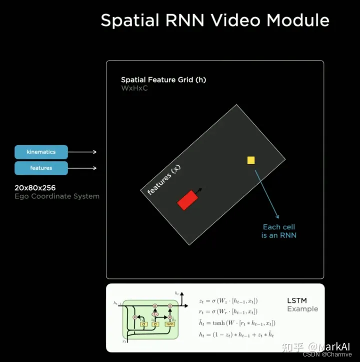

图九，空间RNN作为视频模块

通过可视化该RNN的feature，可以更加明确该RNN具体做了什么：不同channel分别关注了道路边界线，车道中心线，车道线，路面等等。

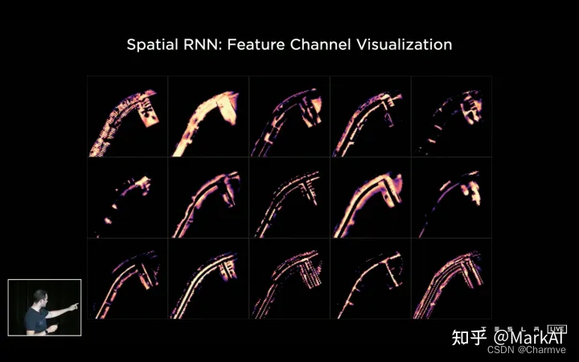

图十，空间RNN学到的特征可视化

添加了视频模块之后，能够提升感知系统对于时序遮挡的鲁棒性，对于距离和目标移动速度估计的准确性。

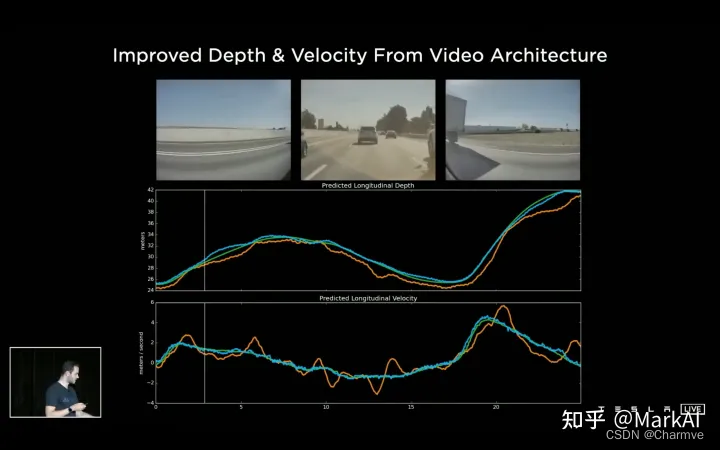

图十一，加入视频模块可以改善对目标距离和运动速度的估计，绿线为激光雷达的GT，黄线和蓝线分别为加入视频模块前后模型的预测值

####  1.1.3 最终的模型

在初版HydraNet的基础上，使用Transformer整合了多个相机的特征，使用Feature Queue维护一个时序特征队列和空间特征队列，并且使用Video Module对特征队列的信息进行整合，最终接上HydraNet各个视觉任务的Head输出各个感知任务。

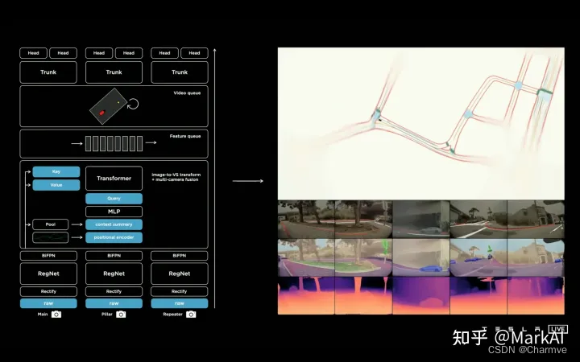

图十二，最终完整的模型结构以及对应感知结果

整个感知系统使用一个模型进行整合，融合了多个相机时序上和空间上的信息，最终直接输出所有需要的感知结果，一气呵成，非常干净和优雅，可以当做教科书一般。

赞叹该系统的精妙之外，也可以看到Tesla团队强大的工程能力，背后强大的算力和数据标注系统是支持这一切的前提，当然，那啥，本质上还是有钱啦……

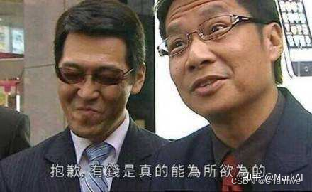

此外，该系统也并不是最终版的自动驾驶感知系统，还会一直不断迭代升级，国内的同行们要加油了！！

最后，我想说的是……虽然不敢打包票Tesla到底有没有被Hydra资助or控制←_←但他们作为一家科技公司可以那么详细的无私分享自己的技术细节，确实让人敬佩！Respect and Thank you！

### 2. BEV进化：Tesla Occupancy Network

如果在鸟瞰图坐标系下的BEV感知是高水平视觉为主的自动驾驶方案的敲门砖，那么Occupancy Network就是纯视觉自动驾驶技术的又一里程碑。Occupancy Network最早在去年其实就出现在FSD Beta的Release Note中，但是广泛的为大家熟知应该来自于CVPR 2022 自动驾驶workshop中Ashok的分享。

从Ashok的分享可以看出，占据栅格网络Occupancy Network并非推翻了鸟瞰图BEV感知的技术基础，而是对BEV 网络在高度方向进行了进一步的扩展，从上图可以看到整体框架在对各个相机进行图像平面特征提取以后，仍旧是接一个Transformer的模块，在图像feature map中通过MLP生成Value， Key，并利用BEV坐标系下栅格坐标的位置编码生成Query，不同的是这次栅格不只是BEV感知中的2D栅格，而是在高度方向又增加了一个维度变成了3D栅格，进而生成了Occupancy Features替代了原本的BEV Features。

AI Day上的占据栅格技术框架而在AI Day上的分享相比CVPR上又更加详细了一些，这里可以看到3个方面的改进：

1. 最左侧基于原始光子计数（Photon Count）的传感器图像作为模型输入，而没有经过ISP等常见的图像预处理方法，根据Tesla之前的分享可以强化系统在低光照可见度低的条件下提供超越人眼的感知能力。

2. Temporal Alignment利用里程计信息，对前面时刻的栅格特征（Occupancy Features）进行时序上的拼接，如图所示不同时间的feature有着不同的透明度，似乎随着时间远近还有一个权重的衰减，然后时序信息似乎实在Channel维度进行拼接的，组合后的Occupancy Features会进入Deconvolutions的模块来提高分辨率。这样看来目前Tesla在时序利用上可能也更倾向于使用类似Transformer或时间维度作为一个Chanel的时序CNN这样的可并行的时序处理方案，而不是AI Day I中所提到的Spatial RNN这样的RNN方案。

3. 与CVPR公布的方案相比Occupancy Network除了输出3D栅格特征和栅格流（速度，加速度等）以外，还增加了两个机遇Query的亚像素几何和语义输出，这个机遇x，y，z坐标的Query思路很像NeRF（应该是受此启发），能够提供给Occupancy Network变分辨率聚焦能力，相比几个月前的CVPR，已经有了这样更新的迭代，Tesla这样的迭代速度实在令人惊叹。

#### 2.1 为什么是occupancy network?
在基于 LiDAR 的系统中，可以根据检测到的反射强度来确定对象的存在，但在相机系统中，必须首先使用神经网络检测对象。如果看到不属于数据集的对象怎么办？比如侧翻的大卡车。仅此一项，就引发了很多事故。

可行驶区域的一些问题

rv、bev空间下可行驶区域会有一定问题：

- 地平线的深度不一致，只有2个左右的像素决定了一个大区域的深度。
- 无法看穿遮挡物，也无法行驶。
- 提供的结构是 2D的，但世界是 3D 的。
- 高度方向可能只有一个障碍物（悬垂的检测不到），目前是每类对象设置固定的矩形。
- 存在未知物体，例如，如果看到不属于数据集的对象。

所以希望有种通用的方式来解决该问题，首先能想到的是bev下的可行驶区域，但相对来说在高度维会比较受限，索性一步到位变成3d空间预测、重建。

#### 2.2 Occupancy Network
2022 CVPR中，tesla FSD新负责人 Ashok Elluswamy 推出了Occupancy Network。借鉴了机器人领域常用的思想，基于occupancy grid mapping，是一种简单形式的在线3d重建。将世界划分为一系列网格单元，然后定义哪个单元被占用，哪个单元是空闲的。通过预测3d空间中的占据概率来获得一种简单的3维空间表示。关键词是3D、使用占据概率而非检测、多视角。

Occupancy Network

这里输出的并非是对象的确切形状，而是一个近似值，可以理解为因为算力和内存有限，导致轮廓不够sharp，但也够用。另外还可以在静态和动态对象之间进行预测，以超过 100 FPS 的速度运行（或者是相机可以产生的 3 倍以上）。

2020 AI day中的Hydranet算法中有三个核心词汇：鸟瞰图(BEV)空间、固定矩形、物体检测。而occupancy network针对这三点有哪些优化，可以看：

第一是鸟瞰图。在 2020 年特斯拉 AI 日上，Andrej Karpathy 介绍了特斯拉的鸟瞰网络。该网络展示了如何将检测到的物体、可驾驶空间和其他物体放入 2D 鸟瞰视图中。occupancy network则是计算占据空间的概率。

BEV vs Volume Occupancy

最主要的区别就是，前者是 2D表示，而后者是3D表示。

第二是固定矩形，在设计感知系统时，经常会将检测与固定输出尺寸联系起来，矩形无法表示一些异形的车辆或者障碍物。如果您看到一辆卡车，将在featuremap上放置一个 7x3 的矩形，如果看到一个行人，则使用一个 1x1 的矩形。**问题是，这样无法预测悬垂的障碍物**。如果汽车顶部有梯子，卡车有侧拖车或手臂；那么这种固定的矩形可能无法检测到目标。而使用Occupancy Network的话，看到下图中，是可以精细的预测到这些情况的。

固定矩形 vs Volume Occupancy

后者的工作方式如下：

- 将世界划分为微小（或超微小）的立方体或**体素**
- 预测每个体素是**空闲还是被占用**

体素空间中的被占用体素

这里意味着两种方法的思维方式完全不一样，前者是为一个对象分配一个固定大小的矩形，而后者是简单地说**“这个小立方体中有一个对象吗？ ”**。

第三点，物体检测。

目前有很多新提出来的物体检测算法，但大多面向的是固定的数据集，只检测属于数据集的部分或全部对象，一旦有没有标注的物体出现，比如侧翻的白色大卡车，垃圾桶出现的路中，这是没法检测到的。而当思考和训练一个模型来预测“这个空间是空闲的还是被占用的，不管对象的类别是什么？”，正可以避免这种问题。

对象检测 vs Occupancy Network

基于视觉的系统有 5 个主要缺陷：地平线深度不一致、物体形状固定、静态和移动物体、遮挡和本体裂缝。特斯拉旨在创建一种算法来解决这些问题。

新的占用网络通过实施 3 个核心思想解决了这些问题：体积鸟瞰图、占用检测和体素分类。这些网络可以以超过 100 FPS 的速度运行，可以理解移动对象和静态对象，并且具有超强的内存效率。

模型结构：

cvpr 时的网络结构

- 输入为不同视角的图像（总共 8 个：正面、侧面、背面等......）。
- 图像由[RegNet](https://arxiv.org/pdf/2101.00590.pdf)和[BiFPN](https://paperswithcode.com/method/bifpn%23%3A~%3Atext%3DA%2520BiFPN%252C%2520or%2520Weighted%2520Bi%2Cfast%2520multi%252Dscale%2520feature%2520fusion.)等网络提取特征
- 接着transformer模块，使用注意力模块，采用**位置图像编码加上QKV获得特征**，以此来产生占用Occupancy。
- 这会产生一个Occupancy feature，然后将其与之前的体积（t-1、t-2 等）融合，以获得**4D Occupancy feature**。
- 最后，我们使用反卷积来检索原始大小并获得两个输出：Occupancy volume和Occupancy flow。

AI day时的网络结构

相比cvpr时，AI day上的分享更加详细，主要有三点更新：

最左侧是基于photon count的传感器图像作为模型输入（虽然鼓吹的很高大上，其实就是ISP处理前的raw数据），这里的好处是可以在低光照、可见度低等情况下，感知的动态范围更好。
temporal alignment利用里程计信息，对前面时刻的occupancy features进行时序上的加权融合，不同的时间的特征有着不同的权重，然后时序信息似乎实在Channel维度进行拼接的？组合后的特征进入deconv模块提高分辨率。这样看来时序融合上，更倾向于使用类似transformer或者时间维度作为一个channel的时序cnn进行并行的处理，而非spatial RNN方案。
相比CVPR的方案，除了输出3D occupancy特征和occupancy flow（速度，加速度）以外，还增加了基于x,y,z坐标的query思路（借鉴了Nerf），可以给occupancy network提供基于query的亚像素、变分辨率的几何和语义输出。
因为nerf只能离线重建，输出的occupancy 猜想可以通过提前训好的的nerf生成GT来监督？

光流估计和Occupancy flow

特斯拉在这里实际上做的是预测光流。在计算机视觉中，光流是像素从一帧到另一帧的移动量。输出通常是[flow map](https://courses.thinkautonomous.ai/optical-flow) 。

在这种情况下，可以有每一个体素的流动，因此每辆车的运动都可以知道；这对于遮挡非常有帮助，但对于预测、规划等其他问题也很有帮助

Occupancy Flow（[来源](https://www.youtube.com/watch?v=jPCV4GKX9Dw&t=1135s)）

Occupancy flow实际上显示了每个对象的方向：红色：向前 — 蓝色：向后 — 灰色：静止等……（实际上有一个色轮代表每个可能的方向）

#### 2.2 Nerf

特斯拉的 NeRF（[来源](https://link.zhihu.com/?target=https://www.youtube.com/watch?v=jPCV4GKX9Dw)）

神经辐射场，或 Nerf，最近席卷了3D 重建；特斯拉也是其忠实粉丝。它最初的想法是从多视图图像中重建场景。

这与occupancy network 非常相似，但这里的不同之处在于也是从多个位置执行此操作的。在建筑物周围行驶，并重建建筑物。这可以使用一辆汽车或特斯拉车队在城镇周围行驶来完成。

这些 NeRF 是如何使用的？

由于Occupancy network产生 3D volume，可以将这些 3D volume与 3D-reconstruction volume（Nerf离线训练得到）进行比较，从而比较预测的 3D 场景是否与“地图”匹配（NeRF 产生 3D重建）。

在这些重建过程中也可能出现问题是图像模糊、雨、雾等......为了解决这个问题，他们使用车队平均（每次车辆看到场景，它都会更新全局 3D 重建场景）和描述符而不是纯像素。

使用Nerf的descriptor

这就是获得最终输出的方式！特斯拉还宣布了一种名为隐式网络的新型网络，其主要思想是相似的：通过判断视图是否被占用来避免冲突

**总结来说：**

1. 当前仅基于视觉的系统的算法存在问题：它们不连续，在遮挡方面做得不好，无法判断物体是移动还是静止，并且它们依赖于物体检测。 因此，特斯拉决定发明“Occupancy network”，它可以判断 3D 空间中的一个单元格是否被占用。
2. 这些网络改进了 3 个主要方面：鸟瞰图、物体类别和固定大小的矩形。
3. occupancy network分 4 个步骤工作：特征提取、注意和occupancy检测、多帧对齐和反卷积，从而预测光流估计和占用估计。
4. 生成 3D 体积后，使用 NeRF（神经辐射场）将输出与经过训练的 3D 重建场景进行比较。
5. 车队平均采集数据用于解决遮挡、模糊、天气等场景

<bbr>

参考：https://www.thinkautonomous.ai/blog/occupancy-networks/

